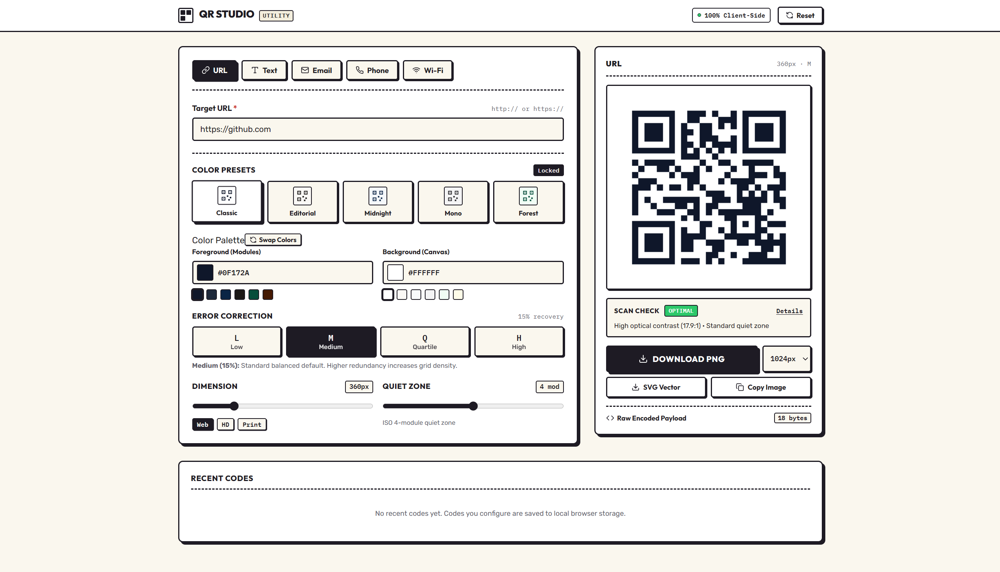
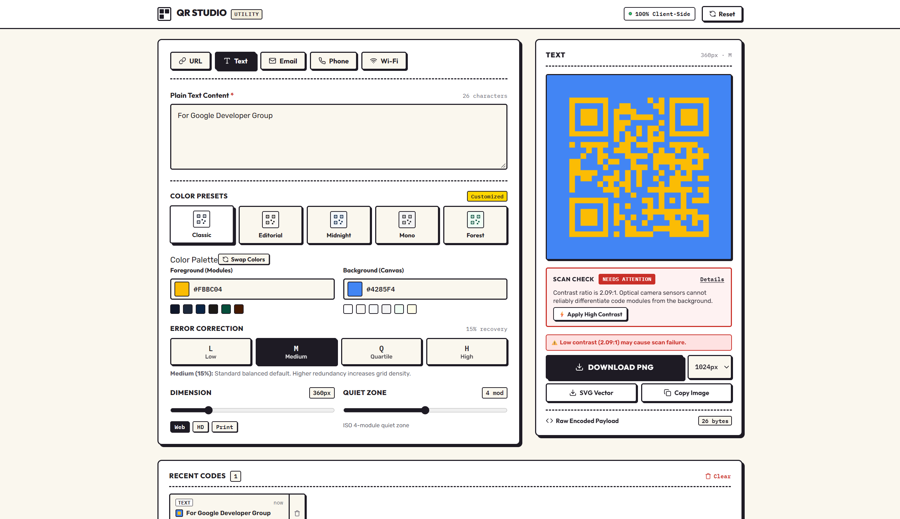

# Qcode Studio

## Project Overview
Qcode Studio is a browser-based QR code generator and designer built with React and TypeScript. It supports multiple QR formats, live customization, scan-safety checks, and local history without requiring a backend.

## Features
- **QR Types**: URL, Plain Text, Email, Phone Number, and Wi-Fi.
- **Customization**: Size, colors, error correction, margin, and visual presets.
- **Live Preview**: Updates instantly as the QR settings change.
- **Scan Safety**: Checks contrast and quiet-zone settings.
- **Export**: PNG, SVG, and copy to clipboard.
- **Recent Codes**: Saves QR configurations locally and allows them to be restored.

## Tech Stack
- **React**
- **TypeScript**
- **Vite**
- **qrcode**
- **CSS**

## How to Run

```sh
npm install
npm run dev
```

## Build

```sh
npm run build
```

No backend is required. Everything runs in the browser.

## Screenshots

<p align="center">
  
  
</p>