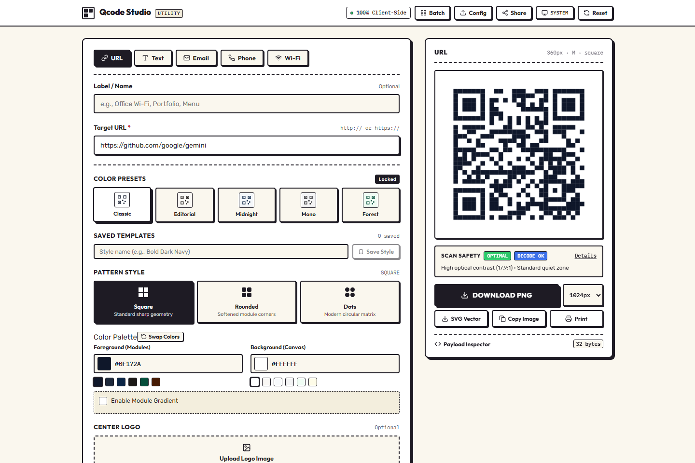
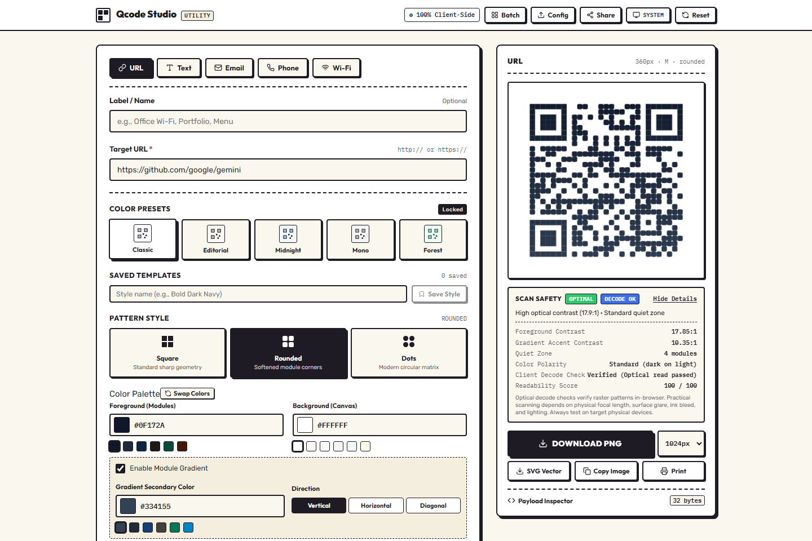
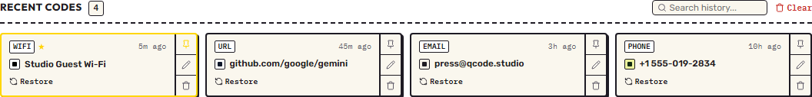
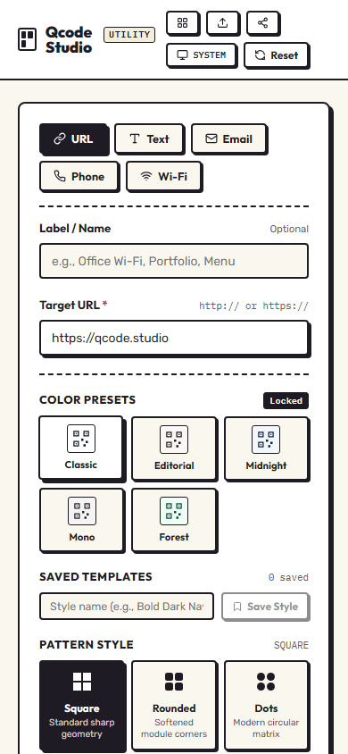

# Qcode Studio

## Project Overview
Qcode Studio is a tactile, browser-based QR code generator and diagnostic tool built with React and TypeScript. It supports multiple QR formats, pattern customization, client-side optical verification, saved templates, shareable configurations, and batch export without requiring a backend or external service.

## Features
- **QR Types**: URL, Plain Text, Email, Phone Number, and Wi-Fi networks (WPA, WEP, Open).
- **Customization**: Module styles (square, rounded, dots), two-color gradients with direction control, custom foreground/background colors, size, quiet zone margins, and error correction levels (L, M, Q, H).
- **Logo Integration**: Upload, scale, and remove custom center logos with automatic Error Correction recommendations.
- **Scan Safety Diagnostics**: Real-time evaluation of contrast ratios (foreground and gradients), quiet zones, module density, and inverted color schemes, coupled with browser-side optical decode checks via `jsQR`.
- **Theme Support**: Light, dark, and system preference modes with independent QR rendering.
- **Saved Templates**: Store, name, apply, and delete reusable QR styles locally.
- **Configuration Portability**: Export and import complete configuration schemas as JSON with validation; generate client-only shareable URLs encoded in hash fragments.
- **Image Import**: Upload existing QR images to decode their payload and populate the editor.
- **Batch Generator**: Create multiple QR codes from structured text or CSV and download them as a ZIP archive.
- **Export & Print**: High-resolution PNG (512px, 1024px, 2048px), vector SVG, image clipboard copying, and print-optimized layout.
- **History**: Local persistence with search, pinning, inline renaming, and single-click restoration.
- **Payload Inspector**: Disclosure view showing encoded payload string, byte counts, and QR matrix metadata.

## Tech Stack
- **React 19**
- **TypeScript**
- **Vite**
- **qrcode** (matrix and SVG generation)
- **jsQR** (client-side optical decode validation and image import)
- **JSZip** (in-browser ZIP archiving for batch generation)
- **Playwright** (end-to-end testing)
- **Node Test Runner** (unit testing)

## Architecture
The application separates concerns across distinct modules and custom hooks:
- `src/types/`: Strict TypeScript interfaces for form data, customizations, templates, history, and scan safety reports.
- `src/utils/qrPayload.ts`: Payload formatting standards and bidirectional decoding.
- `src/utils/qrRenderer.ts`: Canvas rasterization, SVG construction, and optical decode verification.
- `src/utils/validation.ts`: Format-specific input validators.
- `src/utils/scanSafety.ts`: WCAG contrast ratios, layout diagnostics, and heuristic scoring.
- `src/utils/storage.ts`: LocalStorage management with deduplication, pinning, and schema validation.
- `src/utils/export.ts`: File exports, clipboard writes, and ZIP archive bundling.
- `src/hooks/`: Modular state management (`useQrEditor`, `useQrCustomization`, `useQrHistory`, `useQrTemplates`, `useTheme`, `useShareConfig`).
- `src/components/`: Tactile UI components for forms, editors, canvas preview, history tape, and utility modals.

## Testing
The test suite covers unit and end-to-end requirements:

- **Unit Tests**: Form validation rules, payload generation, contrast calculations, storage deduplication, template management, and configuration import/export schemas.
- **End-to-End Tests**: Full browser flows across all 5 QR types, valid/invalid inputs, customization changes, preset selection, PNG/SVG exports, clipboard copies, optical decodability checks, localStorage persistence, theme switching, and mobile responsiveness.

Run all tests:
```sh
npm test          # Unit test suite
npm run test:e2e  # Playwright E2E suite
```

## How to Run

### Install Dependencies
```sh
npm install
```

### Development Server
```sh
npm run dev
```

### Production Build
```sh
npm run build
```

### Preview Build
```sh
npm run preview
```
## Screenshots

<p align="center">
  
  
</p>

<p align="center">
  
</p>

<p align="center">
  
</p>